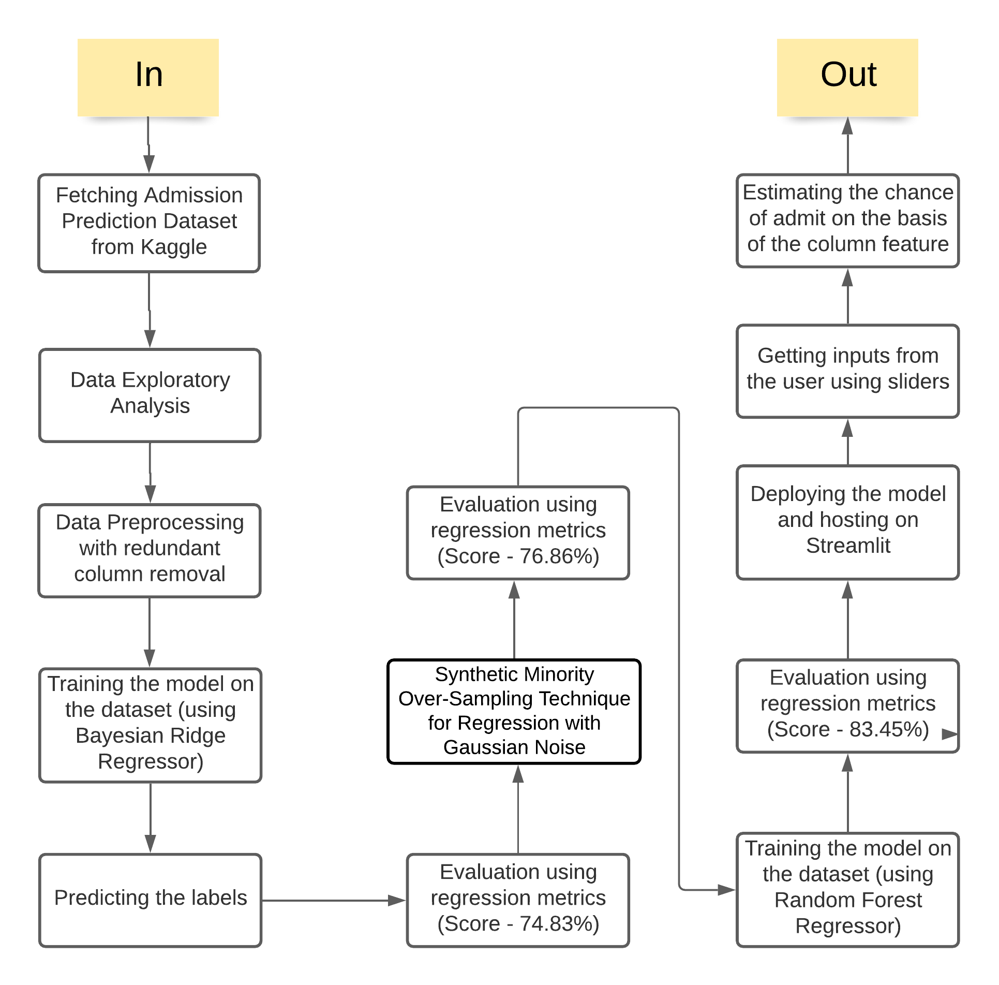

# Predicting Admission Acceptance into University using Regression and SMOGN technique
Link: https://share.streamlit.io/aaryamansingla/predicting-admission-acceptance-into-university-using-regression-and-smogn-technique/app.py
  Do you have a chance of getting admission into top US universities? Well this website serves the purpose of evaluating how strong your PROFILE is!!!

## Introduction to the project
Getting into the best US universities is everybody's dream. To get admission to the best universities, a candidate needs to have a strong profile, like `GRE Score, TOEFL Score, LOR, SOP, CGPA and Research` and many more requirements. 

## HOW TO USE THE DEPLOYED MODEL
Use the slider to input the different values of GRE Score, TOEFL Score, University Rating, LOR, SOP, CGPA and Research using the slider provided for each individual category to get the chances of admit.
[For reference, check input-output screenshot folder in the repository]

## Data Explained :
Dataset Link: https://www.kaggle.com/mohansacharya/graduate-admissions?select=Admission_Predict.csv
* GRE Scores ( out of 340 )
* TOEFL Scores ( out of 120 )
* University Rating ( out of 5 )
* Statement of Purpose and Letter of Recommendation Strength ( out of 5 )
* Undergraduate GPA ( out of 10 )
* Research Experience ( either 0 or 1 )
* Chance of Admit ( ranging from 0 to 1 )

## Used libraries
In this project, the dataset is trained on Random Forest Regressor machine learning model. Used libraries: 
* `pandas` for data manipulation 
* `Seaborn` and `Matplotlib` for data visualisation
* `Sklearn` for training the model and deriving the errors and accuracy.
* `pickle` module to dump the model to save and load it
* `smogn` module to balance classes for increasing dataset
* `streamlit` library for deployment and hosting

## Methodology used
1. Fetching Admission Prediction Dataset from Kaggle
2. Data Exploratory Analysis
3. Data Preprocessing with redundant column removal
4. Training the model on the dataset (used Random Forest Regressor and Bayesian Regressor)
5. Predicting the labels
6. Evaluation using regression metrics 
7. Deploying the model and hosting on Streamlit
8. Getting inputs from the user using sliders
9. Estimating the chances of admission on the basis of the column feature

